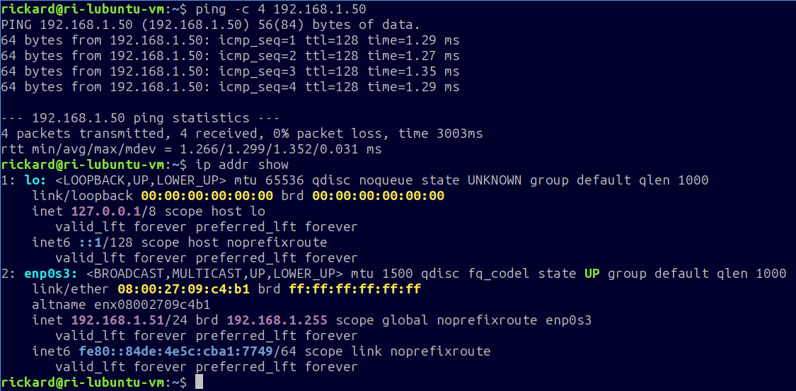
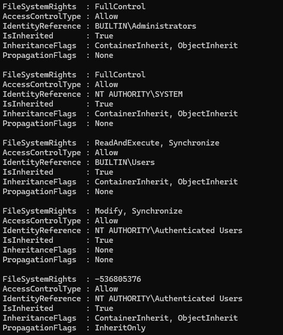
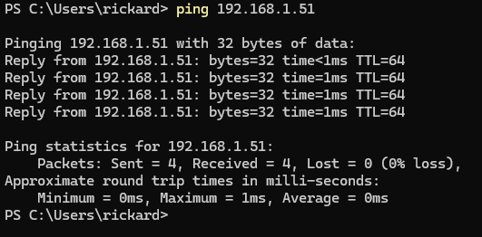
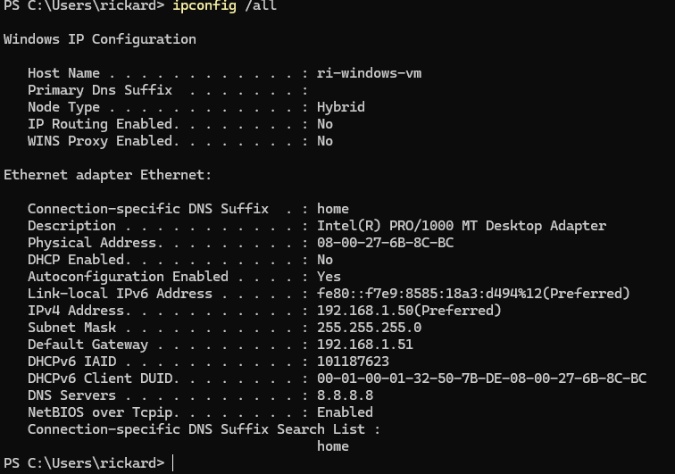
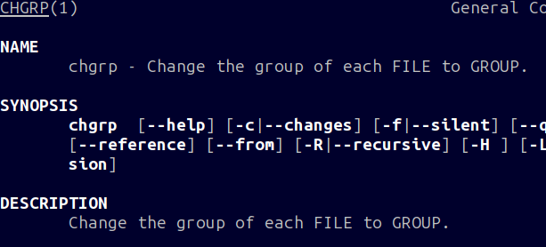

# Labbdokumentation

## Introduktion

Jag heter Rickard Eklund. Det är den 2 oktober 2026 och jag går i kursen Introduktion till yrkesrollen och grunderna i IT-infrastruktur.

Labbmiljön består av två virituella maskiner; en Windows 11-vm och en Lubuntu-vm. De är kopplade till varandra i ett internt nätverk.

## Labbmiljö & Nätverk (Kursmål 8)

| Hostname      | Operativsystem  | IP-adress    | Subnätmask    | Standard Gateway |
|---------------|-----------------|--------------|---------------|------------------|
| ri-windows-vm | Windows 11 Pro  | 192.168.1.50 | 255.255.255.0 | 192.168.1.51     |
| ri-lubuntu-vm | Lubuntu 26.04.1 | 192.168.1.51 | 255.255.255.0 | 192.168.1.50     |

## Kommandoradsgenomförande (Kursmål 9)

### Linux

**1: Skapa mappen /var/systementor/konsultdata och filen anteckningar.txt via CLI:**

```sudo mkdir -p /var/systementor/konsultdata && sudo touch /var/systementor/konsultdata/anteckningar.txt```

Man behöver använda sudo för att mappen /var/ ägs av root. mkdir skapar mappen, -p gör att mappen /var/systementor/ skapas om den inte finns. ```&&``` kan man använda för att sätta ihop flera kommandon; när det första kommandot är klart så görs det andra, när det är klart görs det tredje osv. touch skapar en tom fil.

**2: Skapa en ny användargrupp (konsulter):**

```sudo groupadd konsulter```

**3.1: Tilldela mappen och filen till gruppen:**

```sudo chgrp -R konsulter /var/systementor/konsulter```

chgrp ändrar vilken grupp som äger en fil eller mapp. -R gör att alla filer i mappen man pekar på också blir ägda av gruppen

**3.2: Ställ in behörigheter till mappen och filen:**

```sudo chmod 750 /var/systementor/konsulter && sudo chmod 640 /var/systementor/konsulter/antäckningar.txt```

chmod ändrar behörigheter på mappar och filer

**4: Inspektera och dokumentera behörigheterna via CLI:**

Rättigheterna för mappen konsultdata (som man får av ```ls -la /var/systementor```) är: ```drwxr-x--- root konsulter``` 

Detta betyder i ordning: Det är en mapp (directory), ägaren kan läsa (read), ägaren kan skriva (write), ägaren kan exekvera, gruppen kan läsa,gruppen kan *inte* skriva (-), gruppen kan exekvera, andra användare kan *inte* läsa, skriva eller exekvera, root är ägar-användaren, konsulter är ägar-gruppen.

Rättigheterna för filen antäckningar.txt (som man får av ```ls -la /var/systementor/konsulter```) är: ```-rw-r----- root konsulter```

Detta betyder i ordning: Det är inte en mapp, ägaren kan läsa, skriva, *inte* exekvera, gruppen kan läsa, men *inte* skriva eller exekvera, andra användare kan *inte* läsa, skriva eller exekvera, root är ägar-användaren, konsulter är ägargruppen.

**5: Verifiera nätverksanslutningen till Windows-VM samt visa nätverkskortets detaljer**

Här är output av ```ping``` och ```ip addr show```



### Windows

**1: Skapa mappen C:\Systementor\KonsultData via CLI.:**

```New-Item -ItemType Directory -Path "C:\Systementor\KonsultData"```

Väldigt långt kommando men förklarar sig sjävlt bra. Med -Path så läggs mappen Systementor till om den inte finns.

**2: Inspektera och dokumentera behörighetsstrukturen/ACL för mappen via PowerShell (Get-Acl):**

```Get-Acl C:\Systementor\KonsultData```

Ett kommando som ger en kort output av behörigheter. Här är output av kommandot:

| Path        | Owner                  | Access                                      |
|-------------|------------------------|---------------------------------------------|
| KonsultData | BUILTIN\Administrators | BUILTIN\Administrators Allow FullControl... |

För mer information kan man använda detta:

```(Get-Acl C:\Systementor\KonsultData).Access```



**3: Verifiera nätverksanslutningen till Linux-VM:en (Test-Connection eller ping) och inspektera nätverksinställningarna (ipconfig /all).**





## Git & Versionshantering (Kursmål 10)

https://github.com/ricekl/labbmiljo

## AI-logg & Reflektion (Kursmål 11)

Jag använde ChatGPT för att ta reda på hur man ändrade gruppägaren av en fil eller mapp i linux.
Jag använde denna promt ```how do i change the group owner of a folder in linux```
ChatGPT föreslog att jag skulle använda kommandot ```chgrp``` som jag inte har sett förut. Den föreslog även att jag skulle använda kommandot med ```-R``` flaggan som även ändrar ägaren av alla filer i mappen till gruppen man skrev.

Jag öppnade linux terminalen och skrev ```man chgrp``` för att få fram en manual för kommandot för mer information. Där stod det tydligt att ChatGPT hade rätt:




